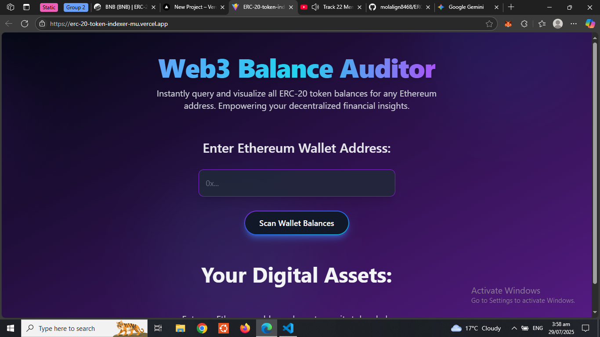

# ERC-20-token-indexer

## 🚀 Live Demo https://erc-20-token-indexer-mu.vercel.app/



## Overview

The **ERC-20-token-indexer** is a modern, responsive single-page application designed to provide quick and clear insights into the ERC-20 token holdings of any Ethereum address. Leveraging **React.js** for a dynamic user interface, styled beautifully with **Tailwind CSS**, and powered by **Alchemy's robust Web3 API**, this tool simplifies the process of auditing digital assets on the Ethereum blockchain. Users can effortlessly enter an Ethereum address and instantly view all associated non-zero ERC-20 token balances along with their respective metadata (name, symbol, logo).

This project focuses on delivering a smooth, engaging user experience with a futuristic Web3 aesthetic, making decentralized finance information more accessible and visually appealing.

## Features

- **Instant ERC-20 Balance Lookup:** Quickly query and display token balances for any valid Ethereum address.
- **Comprehensive Token Metadata:** Fetches and presents essential details for each token, including name, symbol, and official logo (where available).
- **Intuitive & Responsive UI:** Crafted with Tailwind CSS to ensure optimal viewing and interaction across various devices, from mobile phones to large desktop monitors.
- **Dynamic Visuals:** Incorporates subtle animations and gradient backgrounds for a modern, immersive Web3 aesthetic.
- **Client-Side Only Architecture:** Demonstrates a pure frontend implementation, directly interacting with blockchain data via a robust API.
- **Robust Input Validation & Error Handling:** Provides clear feedback for invalid wallet addresses or API communication issues.
- **CDN-Friendly Styling:** Utilizes Tailwind CSS via CDN, simplifying the setup and deployment process.

## Technologies Used

- **[React.js](https://react.dev/)**: A JavaScript library for building user interfaces.
- **[Tailwind CSS](https://tailwindcss.com/)**: A utility-first CSS framework for rapidly styling responsive designs.
- **[Alchemy SDK](https://www.alchemy.com/alchemy-sdk)**: A powerful SDK for interacting with the Ethereum blockchain and fetching comprehensive data.
- **[Vite](https://vitejs.dev/)**: A fast build tool for modern web projects (inferred from `import.meta.env.VITE_ALCHEMY_API_KEY`).
- **HTML5 / CSS3 / JavaScript (ES6+)**

## Getting Started

Follow these instructions to get a copy of the project up and running on your local machine for development and testing purposes.

### Prerequisites

You need to have Node.js and npm (or Yarn) installed on your machine.

- [Node.js](https://nodejs.org/en/download/) (v14.0.0 or higher recommended)
- [npm](https://docs.npmjs.com/downloading-and-installing-node-js-and-npm) (usually comes with Node.js) or [Yarn](https://yarnpkg.com/getting-started/install)

### Installation

1.  **Clone the repository:**

    ```bash
    git clone https://github.com/molalign8468/ERC-20-token-indexer.git
    cd ERC-20-token-indexer
    ```

2.  **Install project dependencies:**

    ```bash
    npm install
    # OR
    yarn install
    ```

3.  **Set up your Alchemy API Key:**
    - This project requires an Alchemy API key to interact with the Ethereum blockchain. You can get one for free by signing up at [Alchemy](https://www.alchemy.com/).
    - Create a file named `.env` in the **root directory** of your project (the same level as `package.json`).
    - Add your Alchemy API key to this file in the following format:
      ```env
      VITE_ALCHEMY_API_KEY=YOUR_ACTUAL_ALCHEMY_API_KEY_HERE
      ```
      **Important Security Note:** The `.env` file should **never** be committed to your public Git repository. It's already included in the `.gitignore` file, but double-check to ensure it's not accidentally pushed.

### Running the Application Locally

After setting up the API key and installing dependencies, you can start the development server:

```bash
npm run dev
# OR
yarn dev
```
